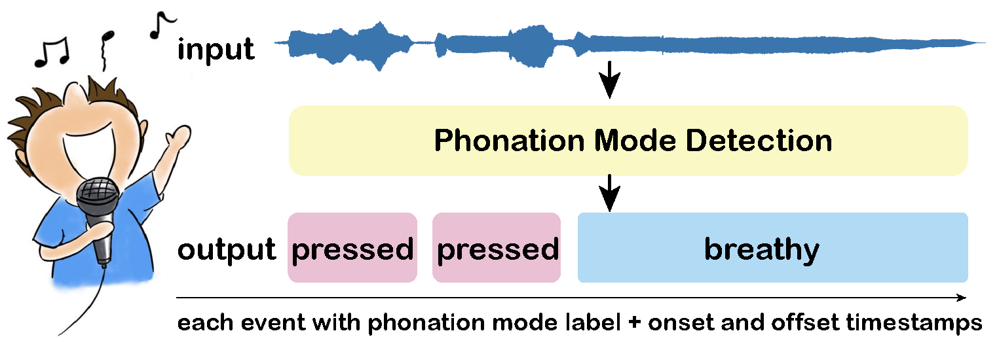

# PMD-Singing: Phonation Mode Detection in Singing
This is the author's official PyTorch implementation for PMD-Singing. This repo contains code for experiments in the **ICASSP 2023** paper:

[Phonation Mode Detection in Singing: a Singer Adapted Model](https://ieeexplore.ieee.org/document/10095669)


## Project Overview
<p align="center">

</p>


## Abstract

Phonation modes play a vital role in voice quality evaluation and vocal health diagnosis. Existing studies on phonation modes cover feature analysis and classification of vowels, which does not apply to real-life scenarios. In this paper, we define the phonation mode detection (PMD) problem, which entails the prediction of phonation mode labels as well as their onset and offset timestamps. To address the PMD problem, we propose the first dataset PMSing, and an end-to-end PMD network (P-Net) to integrate phonation mode identification and boundary detection, which also prevents the over-segmentation of frame-level output. Furthermore, we introduce an adapted P-Net model (AP-Net) based on an adversarial discriminative training process using labeled data from one singer and unlabeled data from unseen singers. Experiments show that the P-Net outperforms the state-of-the-art methods with an F-score of 0.680, and the AP-Net also achieves an F-score of 0.658 for unseen singers.

## Prerequisites
Install Anaconda and create the environment with python 3.8.13, pytorch 1.11.0 and cuda 11.3:
```
conda create -n pmd python=3.8.13
conda activate pmd
pip install torch==1.11.0+cu113 torchaudio==0.11.0 -f https://download.pytorch.org/whl/torch_stable.html
```

Our expeiments is built on [SpeechBrain toolkit](https://github.com/speechbrain/speechbrain). To install it, please run the following commands:
```
pip install speechbrain
```

## Singing Voice Dataset for Phonation Mode Detection
The Sung Phonation Mode Dataset (noted as PMSing in paper) is the first multi-phonation audio dataset for PMD task. The dataset is released here: ([https://doi.org/10.5281/zenodo.7657058](https://doi.org/10.5281/zenodo.7657058)).

The total duration of PMSing is 1.51 h, containing 42 songs with an average duration of 2.16 min. Compared to existing PMC datasets, the PMSing dataset contains a longer duration, and the duration of the phonation modes varies from 0.01 to 6.89 s. Additionally, all the audio files in PMSing contain multiple phonation modes.

Please the dataset should be organized as:
```
/path/to/PMD-singing
├── data
    ├── PMSetAudio
        ├── utterance_lvl
            ├── PMSing
                ├── ....
   
```
We welcome your attention on our work. If you want to get access to the full dataset, please read the [Terms and Conditions of this dataset](https://docs.google.com/document/d/1Y32szo1KJWlrE0GNi6oj6KXseP1IIzcL/edit?usp=sharing&ouid=106230029936168767368&rtpof=true&sd=true). If you agree all the terms, please send the signed Ts and Cs document to Prof. Ye Wang at wangye@comp.nus.edu.sg and CC Yixin Wang at yxwang@sei.xjtu.edu.cn.

## Usage
We follow the training and evaluation logic of SpeechBrain. Please refer to [SpeechBrain tutorials](https://speechbrain.github.io/).

To run pre-training experiment:
```
python train.py models/PNet/run_model.yaml
```

To run singer adaptation experiment:
```
python train_da.py models/APNet/run_model.yaml
```

## Citation
If you use PMD-Singing or this codebase in your own work, please cite our paper:
```BibTex
@INPROCEEDINGS{yixin2023singing,
  author={Wang, Yixin and Wei, Wei and Wang, Ye},
  booktitle={ICASSP 2023 - 2023 IEEE International Conference on Acoustics, Speech and Signal Processing (ICASSP)}, 
  title={Phonation Mode Detection in Singing: A Singer Adapted Model}, 
  year={2023},
  volume={},
  number={},
  pages={1-5},
  doi={10.1109/ICASSP49357.2023.10095669}}

@ARTICLE{yixin2023singingspeech,
  author={Wang, Yixin and Wei, Wei and Gu, Xiangming and Guan, Xiaohong and Wang, Ye},
  journal={IEEE/ACM Transactions on Audio, Speech, and Language Processing}, 
  title={Disentangled Adversarial Domain Adaptation for Phonation Mode Detection in Singing and Speech}, 
  year={2023},
  volume={31},
  number={},
  pages={3746-3759},
  doi={10.1109/TASLP.2023.3317568}}
```
